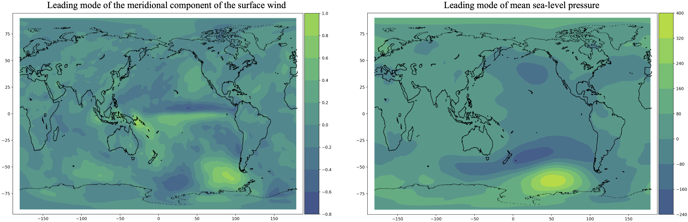

# Summary

Large unstructured datasets may contain complex coherent patterns that 
evolve in time and space, and that the human eye cannot grasp. These 
patterns are frequently essential to unlock our understanding of complex 
systems that can arise in nature, such as the evolution of the atmosphere 
in the short (weather prediction) and long term (climate prediction), 
the behavior of turbulent flows, and the dynamics of plate tectonics, 
among several others. Identifying these coherent structures can 
prove crucial to facilitate the construction of modeling tools that can 
help anticipate scenarios that would otherwise be not predictable.

Within this context, dynamical system theory, complemented with recent 
advances in machine learning and data mining tools, is achieving tremendous 
advances in our ability to acquire actionable information from complex 
data. Singular-value decomposition based tools, in particular, are a 
promising area that is gaining popularity, due to its links to reduced 
order modeling and dynamical systems. Also, these tools can be used in 
the context of machine learning as additional inputs to the learning 
architecture, thereby augmenting the dataset and possibly helping in 
the interpretability of the results. 

While, several variants of singular-value decomposition based techniques 
have been proposed in the literature, this library provides an efficient 
implementation of the so-called spectral proper orthogonal decomposition 
(SPOD) [@lumley1970], [@towne2017], that is also referred to as spectral 
empirical orthogonal function (SEOF) in the weather and climate community 
[@schmidt2019a]. SPOD differs from other SVD-based techniques as it is 
derived from a standard (space-time) POD problem for stationary data and 
leads to modes that are (i) time harmonic and oscillate at a single frequency, 
(ii) are coherent in both time and space, (iii) optimally represent the space-time
statistical variability of the underlying stationary random processes, and 
(iv) are both spatially and space-time orthogonal (see also [@schmidt2020]). 
We note that the `PySPOD` implements the Python counterpart of the Matlab 
code in [@schmidt-code], with the addition of the streaming algorithm outlined 
in [@schmidt2019b]. We also acknowledge that there exist other two Python 
packages implementing SPOD. The first, [spod-code-jburrows], is also a 
Python counterpart of the Matlab code in [@schmidt-code]. However, our 
implementation provides extensive post-processing capabilities, testing, 
and tutorial. It also adds the streaming version [@schmidt2019b], that 
is not present in [spod-code-jburrows]. Similar differences exist between `PySPOD` 
and the Python package presented in [spod-code-loiseau].

# Capabilities 

`PySPOD` is a modular Python package that implements three different variants 
of SPOD, (i) a low storage, (ii) a low RAM, and (iii) a streaming version 
[@schmidt2019b]. The three versions differ in terms of I/O and RAM requirements. 
The low storage version allows faster computations, and it is intended for small 
datasets, or large RAM machines. The low RAM and streaming versions can handle 
large datasets, but they are typically slower than the low storage counterpart. 
The API to the library offers a flexible and user-friendly experience, and 
the library can be complemented with additional SPOD algorithms in an easy-to-implement
way. The structure of the library and the use of Python enable efficient 
interfacing with low level and highly optimized libraries (written in C 
or Fortran) for the calculation of e.g. the fast Fourier transform, eigenvalue 
decomposition, and other linear algebra operations. Users can also take advantage 
of the ready-to-use postprocessing tools offered, and they can easily extend 
the postprocessing functionalities to suit their needs. 

`PySPOD` is designed to be used in different fields of engineering and applied 
science, including weather and climate, fluidmechanics, seismology, among others.
It can be used as a production code, for the analysis of large datasets, as well 
as for experimenting on smaller problems. Users can be students and experts alike.
For an overview of the guidelines one should follow when using SPOD, the reader 
can refer to [@schmidt2020].

In figure \autoref{fig:MEI}, we show the application of this package to identify 
the Multivariate ENSO Index from ECMWF reanalysis datasets (E20C in particular), 
where we used monthly averages of (i) mean sea level pressure (MSL), (ii) Zonal 
component of the surface wind (U10), (iii) Meridional component of the surface 
wind (V10), (iv) Sea surface temperature (SST),(v) 2-meter temperature (T2M), 
and (vi) Total cloud cover (TCC). Figure \autoref{fig:MEI} shows the leading 
modes of the meridional component of the surface wind (left), and of the mean 
seal-level pressure (right). It is possible to appreciate a possible coupling 
between ENSO and the vortices over West Antarctica (that in turn could affect 
the height of the ice shelves [@paolo2018]). For more detail regarding this 
simulation, the interested reader can refer to [@schmidt2019a].

# Acknowledgements

# References
